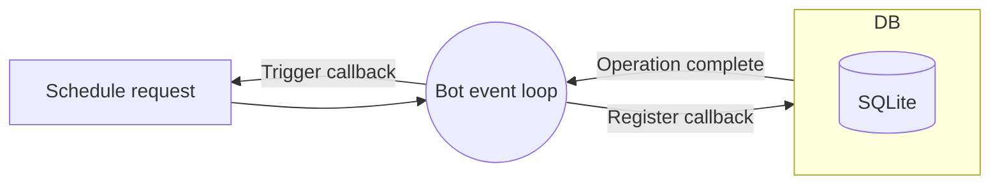

# **discord-bot**

This project builds a simple Discord bot which was designed to make our Discord life easier and cooler.

## **Features**

- `/echo <message>`: Echo the same message content to the user
- `/ban <user> [reason]`: Ban user
- `/kick <user> [reason]`: Kick user
- `/brodcast <channel> <message> <minutes>`: Send the scheduled message to a channel
- `/unbrodcast <channel>`: Remove the scheduled message from a channel
- `/clear <channel>`: Clear the chat history of a channel
- `/create <channel>`: Create a channel
- `/delete <channel>`: Delete a channel
- `/send_to <channel> <message>`: Send the message to a specific channel

> `[arg]`: optional argument; `<arg>`: required arugment

## **Setup**
### 1. Installation
- Installation
- Clone repository
  ```bash
  git clone git@github.com:Retr0327/discord-bot.git
  ```
- Install Requirement
  ```
  cd discord-bot && pip install -r requirements.txt
  ```

### 2. Environment variables
Please create a `.env` file under the current folder `/discord-bot`:

```env
TOKEN=[discord-bot-token]
GUILD=[discord-channel-id]
```


### 3. Start the bot
There are two main ways to run the bot: 

- in Python
  
  First make sure you are in the `discord-bot` folder, and then simply run:

  ```bash 
  python ./bot/bot.py
  ```
  or 
  ```bash 
  python -u "./bot/bot.py"
  ```

- run in Docker

  Install Docker, and use the following command to run:

  ```bash
  docker compose up
  ```

## Commands Guide
> This bot accepts only slash commands


### 1. User related
#### `/echo <message>`
Echo the exact same message content back to the user, providing a response to their original message.

#### `/ban <user> [reason]`
Impose a mute on a particular user, preventing he/she from sending messages in a specified channel. You can optionally supply a `reason` argument to specify the reason for the mute.

#### `/kick <user> [reason]`
Remove a specific user from a channel. You can optionally supply a `reason` argument to specify the reason for kicking he/she out.


### 2. Channel related
#### `/brodcast <channel> <message> <minutes>`
Regularly send messages to a specific channel. Here is the overview of the brodcasting architecture:



If a user brodcast a message to a specific channel, the Discord bot will register the task to its event loop. When restarting, the bot checks the database for any pending tasks and, if present, adds them to its event loop.
 

#### `/unbrodcast <channel>`
Remove the scheduled message from a channel. In other words, the Discord bot will cancel the scheduled task from its event loop.

#### `/clear <channel>`
Clear the chat history of a specific channel.

#### `/create <channel>`
Create a Discord text channel.

#### `/delete <channel>`
Delete a Discord text channel.

#### `/send_to <channel> <message>` 
Send the message to a specific channel.


## Contact Me
If you have any suggestion or question, please do not hesitate to email me at lixing.dev@gmail.com
